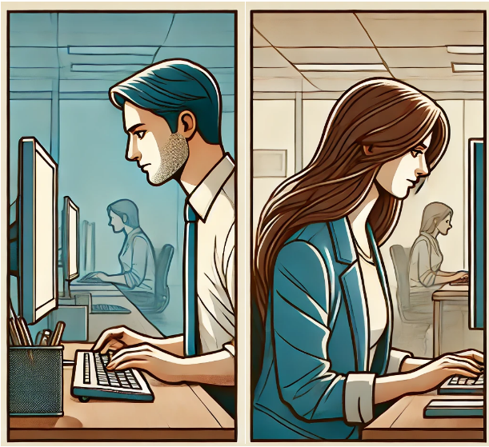
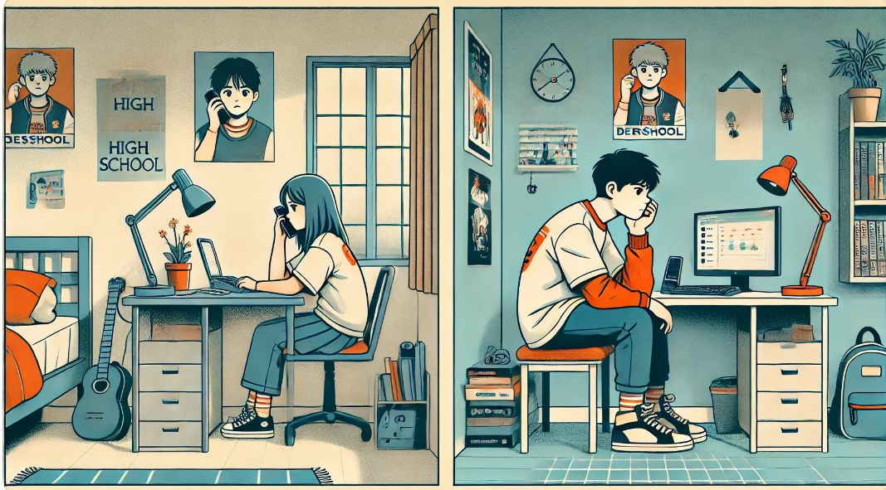

# 프로젝트 - DayLog

## 1. 기획서

### 1. 프로젝트 소개

요즘 연인들은 영상통화를 통해 일상을 공유하고 재미있는 대화를 나누며 추억을 쌓습니다.  
하지만, 소중한 순간들이 통화가 종료되면 사라지는 것은 아쉽습니다.  
**DayLog**는 연인들이 영상통화 중 나눈 재미있고 중요한 대화의 **하이라이트를 AI를 통해 클립으로 생성**하고, 커플의 추억을 관리하는 앱입니다.

### 2. 목표

| 항목                            | 내용                                                                                                |
| ------------------------------- | --------------------------------------------------------------------------------------------------- |
| 추억의 효과적인 저장 및 공유    | 영상통화 중의 소중한 순간들을 AI를 통해 하이라이트 클립으로 저장하고 쉽게 공유할 수 있게 합니다.    |
| 연인 간의 소통 강화             | 대화의 하이라이트를 통해 서로의 일상과 감정을 더 깊이 이해하고 소통할 수 있게 합니다.               |
| 그림 일기 공유를 통한 감정 교류 | 즐거웠던 기억을 AI가 그려주는 그림을 통해 재밌게 공유하며 서로의 감정을 나누고 교류하도록 돕습니다. |
| 재미 요소 추가로 관계 유지      | 재미있는 클립과 추억을 통해 연인 간의 관계를 더욱 즐겁고 활기차게 유지할 수 있게 합니다.            |

### 3. 타겟 / 페르소나

<table>
  <tr>
    <td colspan="3" style="text-align: center;">
      
      
20대 직장인 커플

    </td>
  </tr>
  <tr>
    <td style="text-align: center;">특징</td>
    <td style="text-align: center;">필요성</td>
    <td style="text-align: center;">사용 이유</td>
  </tr>
  <tr>
    <td> 서로 다른 회사에 다니며 바쁜 직장 생활로 인해 만나는 시간이 제한적입니다. </td>
    <td> 업무로 인한 스트레스를 덜고 함께한 소중한 시간을 간직하고 싶어합니다. </td>
    <td> 영상통화 하이라이트와 채팅 기능을 통해 바쁜 일상 속에서도 서로의 일상을 공유하고, 재미 요소를 추가하여 스트레스를 해소하며 관계를 유지할 수 있습니다. </td>
  </tr>
</table>

 

<table>
  <tr>
    <td colspan="3" style="text-align: center;">
      
      
장거리 커플

    </td>
  </tr>
  <tr>
    <td style="text-align: center;">특징</td>
    <td style="text-align: center;">필요성</td>
    <td style="text-align: center;">사용 이유</td>
  </tr>
  <tr>
    <td> 서로 다른 지역 또는 국가에 거주하며, 주로 영상통화로 소통합니다. </td>
    <td> 물리적 거리가 멀어 자주 만날 수 없지만, 서로의 일상과 감정을 지속적으로 공유하고 싶어합니다. </td>
    <td> AI 분석 하이라이트 생성 서비스로 중요한 순간을 기록하여 다시 볼 수 있고, 교환 일기 기능을 통해 특별한 날을 기념하며, 일정 공유 기능으로 서로의 스케줄을 쉽게 파악할 수 있습니다.
 </td>
  </tr>
</table>

### 4. 제안 배경

**제안 배경 | 01 - 기존 커플 앱의 한계**

- 현재 시장에는 다양한 커플 앱이 존재하지만, 대부분의 앱은 단순한 채팅이나 일정 공유 기능에 그칩니다.
- 연인들이 더 풍부하고 다양한 방식으로 소통하고 추억을 저장할 수 있는 기능이 부족합니다. 특히, 영상통화와 같은 실시간 소통에서 중요한 순간을 기록하고 공유할 수 있는 기능이 필요합니다.

**제안 배경 | 02 - 추억의 중요성**

- 연인에게 있어서 소중한 순간들을 기록하고 공유하는 것은 관계를 더욱 돈독하게 만들어줍니다.
- 특별한 날의 사진이나 영상을 다시 꺼내보며 그때의 감정을 되새길 수 있는 기능은 연애 생활에 큰 가치를 더합니다.
- 교환일기와 같은 기능을 통해 특정 시점에 추억을 되돌아보는 것은 매우 감동적인 경험을 제공합니다.

**제안 배경 | 03 - 기존 영상 통화의 문제점**

- 따로 녹화하지 않는 이상 통화 내용을 저장할 수 없습니다.
- 녹화한 통화 내용에서 어느 부분이 흥미롭고 중요한지 바로 찾기 어렵습니다.

### 5. 기대효과

1. **추억의 효과적인 저장 및 공유**
   - 중요한 순간을 자동으로 하이라이트 클립으로 저장하여 언제든지 다시 감상할 수 있도록 하고 즐거운 기억을 일기로 남기면 AI가 그림을 제공함으로써, 연인들이 소중한 추억을 효과적으로 공유할 수 있습니다.
2. **소통 강화**
   - 영상통화, 채팅, 일정 공유 기능 등을 통해 실시간으로 소통하고 서로의 일정을 파악함으로써 더 나은 관계를 유지할 수 있습니다.
3. **재미 요소 추가**
   - 함께 키우는 다마고치와 같은 재미 요소를 통해 앱 사용 자체를 즐겁게 만들고, 일상의 작은 즐거움을 더해 관계를 더욱 활기차게 유지할 수 있습니다.

## 2. 팀원 정보 및 업무 분담

- 프로젝트 기간 : 24.07.15 ~ 진행 중

| 이름   | 역할           | 내용 |
| ------ | -------------- | ---- |
| 조성빈 | 팀 리더        | --   |
| 한지훈 | Back-End 팀장  | --   |
| 김예영 | Back-End 팀원  | --   |
| 박준영 | Front-End 팀장 | --   |
| 김진우 | Front-End 팀원 | --   |
| 조규범 | Front-End 팀원 | --   |

## 3. 기능명세서

## 4. API 명세서

## 5. Info Architecture

## 6. ERD

## 7. 와이어프레임

- 초안

## 8. 페이지 별 기능 설명

### 8.1 회원가입

### 8.2 로그인

### 8.3 영상통화 연결

### 8.4 설정

### 8.5 그림일기

### 8.6 캘린더 작성

## 9. 알고리즘 기술적 설명 (추천 알고리즘)

## 10. Project Gantt Chart

## 11. 느낀점 후기
| 이름     | 역할       | 느낀점 |
|----------|------------|---------------------------------------------------------------------------------------------------------------------------------------------------------------------------------------------------------------------------------------------------------------------------------------------------------------------------------------------------------------------------------------------------------------------------------------------------------------------------------------------------------------------|
| 김예영   | 백엔드     | 먼저 무사히 프로젝트를 완성했다는 것이 정말 기쁩니다. 아이디어톤은 많이 해봤지만 기획부터 개발까지 직접 구현하는 것은 처음이라, 손에 쥐어진 결과물이 더욱 뿌듯합니다. 이번에는 생각지 못하게 스프링 부트로 백엔드를 구현하는 역할을 맡았는데, 좋은 팀원들 덕에 충분히 고민하고 배우는 시간을 가질 수 있어 한층 더 성장할 수 있었습니다. 설계서 및 산출물을 같이 작성할 때도 다함께 의견을 공유하면서 다른 분들의 시각을 배울 수 있어 좋았습니다. 팀원분들 모두에게 정말 감사합니다! |
| 김진우   | 프론트엔드 | 2학기 첫 프로젝트의 시작으로 좋은 팀원들을 만나서 진행하게 되어 정말 좋았습니다. 앱 개발을 목표로 잡으면서 처음으로 Dart와 Flutter를 배워 사용하게 되었습니다. 새로운 언어와 기술로 진행하는 프로젝트는 조금 벅차게 느껴지기도 했지만, 개발자로서 적응하는 법을 알게 되는 귀중한 기회라고 생각되었습니다. 팀원들과 함께 공부하고 프로젝트에 적용해가면서 혼자서 할 땐 몰랐던 부분에 대한 인사이트를 얻고, 소통의 중요성도 깨닫게 되었습니다. 이런 경험을 함께한 팀원들에게 고마움을 전하고 싶습니다.  |
| 박준영   |            |                                                                                                                                                                                                                                                                                                                                                                                                                                                                                                                     |
| 조규범   | 프론트엔드 | 2학기 첫 프로젝트에서 처음으로 모바일 앱 개발을 하게 되면서 플러터라는 프레임워크를 사용하게 되어 새로운 기술을 학습하고 개발에 적용하는 저만의 방법을 체득할 수 있었습니다. 그리고 서비스 기획 과정에서 얼마나 많은 고민과 시간이 필요한 지 알게 되었습니다. 특히 사용자 경험과 서비스의 목적을 고려하여 추가하거나 보완해야 하는 디테일들이 정말 많다는 것을 느꼈습니다. 기획, 디자인부터 실제 개발에 이르는 일련의 개발 과정을 경험할 수 있어서 좋았고, 그 과정에서 팀원들에게 개발 지식과 기술적인 부분을 많이 배울 수 있었습니다.   |
| 조성빈   | 백엔드     | 기획, 설계, 개발까지 다양한 아이디어를 모아 도출하는 과정과 직접 우리의 손으로 구현하는 것이 너무 재미있고 신기했습니다. 또한, 다른 사람들의 코드 스타일이나 방식들을 보면서 많은 것을 배울 수 있었고 개발하는 과정에서 새로운 기술, 네이밍 규칙, 아키텍처 등을 고민하면서 개발자로서의 시야도 넓힐 수 있었습니다. 팀장의 역할을 맡기엔 부족하고 서툴렀지만 잘 따라와 준 팀원들에게 너무 고맙고 고생 많았다고 말해주고 싶습니다.                                                                                     |
| 한지훈   | 백엔드, AI, 인프라 | 기획부터 개발, 배포까지의 프로젝트 개발은 처음이지만 팀원 모두 긍정적으로 프로젝트를 진행하는 것이 재미있었습니다. 저는 인프라는 물론이고 AI 서버, 본격적인 백엔드 서버 개발 전부 처음이었지만 많은 팀원분들이 도움을 주셔서 잘 마무리할 수 있었던 것 같습니다. 팀원분들 다들 고생하면서 프로젝트를 진행하였고, 그만한 결과까지 나와 만족해서 팀원분들께 정말 고맙다고 느꼈습니다.                                                                                                                                                 |
